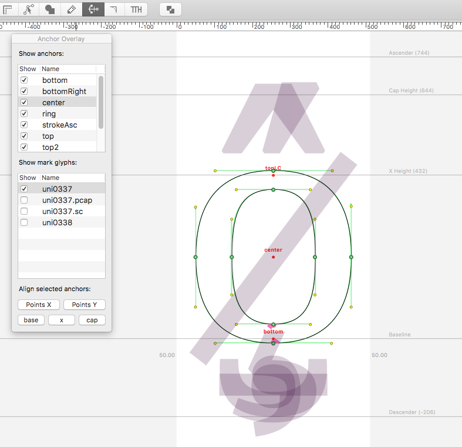

AnchorOverlayTool
=================

Just another way to add anchors and preview accent positions in RoboFont. Installs as a tool in the glyph window toolbar.

* Anchor placement: Double-click anywhere to place an anchor. The anchors are named automatically based on the click position (top, center, bottomRight, etc.)
* Alignment assistance: Select one or more anchors or points and use the alignment buttons

Menu additions:

* *Recompose Selected Glyphs* (ctrl-cmd-R): Reposition components in current or selected glyphs based on anchor positions
* *Export Anchor Table (CSV)*: Export all anchor names and positions for open UFOs as CSV. This helps comparing across the family and finding missing anchors.